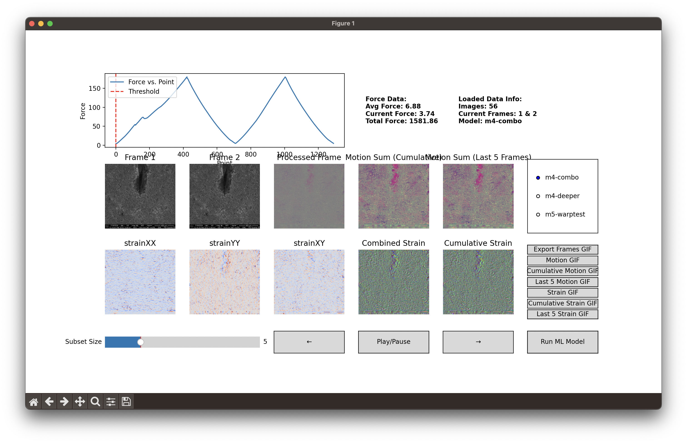

# Image Processing and Strain Analysis Project



## Overview

This project provides a graphical interface for visualizing force data, image sequences, machine learning-processed images, and strain analysis. The system loads a sequence of images, processes them through a machine learning model, and visualizes the resulting displacement and strain data in a structured grid layout.

## Features

- Displays force vs. point data with a read out of the current force for the current frame.
- Loads and displays sequential images from a specified folder.
- Processes images through a machine learning model and caches results.
- Computes and visualizes strain data.
- Includes navigation controls (previous, next, play/pause) to move through image frames.
- Displays metadata about the loaded dataset, including the number of images and current frame indices.

## Folder Structure

To set up the project properly, organize your files and folders as follows:

```
project_directory/
│── images/                   # Folder containing raw input images
│   ├── image_001.png
│   ├── image_002.png
│   ├── ...
│
│── force_data.csv            # CSV file containing force data (x, y, force)
│
│── cached_processed_images/  # Cached processed images (generated automatically)
│                             # It also contains the model outputs as images and npy files
│                             # and holds the strain data for each image
│
│── main.py                   # Main script for running the visualization
```

## Setup Instructions

### 1. Install Dependencies

Firstly, download this repository from GitHub and unzip it.

Install PyTorch from [PyTorch.org](https://pytorch.org/) if you want to use CUDA acceleration.
If you are using a CPU-only machine, you can install like this:

```sh
pip install torch torchvision torchaudio
```

Ensure you have Python installed along with the necessary libraries:

```sh
pip install matplotlib dload imageio opencv-python pandas scikit-image numpy
```

### 2. Organize Images

Place your sequentially numbered images inside the `images/` folder. Its best to have the images named consistently (e.g., `image_001.png`, `image_002.png`, etc.).

### 3. Run the Program

Execute the main script to launch the visualization interface:

```sh
python main.py
```

### Additional Arguments

The default file paths for the image and the force data are these:

```python
file_path = "./force_data.csv" # Optional file to include a graph of force vs. point
image_folder = "./images" # Folder containing images
cache_folder = "./cached_processed_images" # Folder to store processed images if needed
strain_calc_path = "./strain_calc" # Path to strain_calc.exe or strain_calc executable, it will be downloaded if not found
```

If you want to use other ones, you can optionally pass any of the following arguments to the main script:

```python
python main.py --file_path "force_data.csv" --image_folder "images" --cache_folder "cached_processed_images" --strain_calc_path "strain_calc"
```

## Notes

- The `cached_processed_images/` folder will store machine learning-processed images to speed up subsequent runs.
- If new images are added, ensure they are named correctly and clear old cached results if necessary.

## Troubleshooting

- If images do not load, check that the `images/` folder exists and contains valid images.
- If the force plot does not display correctly, verify the CSV file format for force vs. point data. CSV files should have the following format:

```
"Point","Elongation","Force","Position","Code","Samplerate","Motorspeed"
.1,0,3.7384,-1.359,2,100,"0.1 mm/min"
.2,0,3.7228,-1.359,0,100,"0.1 mm/min"
.3,0,3.7197,-1.359,0,100,"0.1 mm/min"
.4,0,3.7852,-1.359,0,100,"0.1 mm/min"
...
```

**How to Add a NEW Model to the Model Output Preview Tool:**

To add a _newly trained model_ or a new _machine learning model architecture_ to be selectable in the Preview tool, you'll generally need to:

1.  **Updating an Existing Model:** If the architrecture is already defined in the Preview tool, you'll need to update the `.pth` file to use the weights file. Just drop your new weights file in the `models/` folder and name it the same as the old one. The Preview tool will automatically detect the new model and use it.

2.  **Adding a New Model Architecture:** If the Preview tool doesn't have a model for the new architecture, you'll need to add it to the Preview tool. The neural network architecture defined in your training file must be _identical_ to the architecture the Preview tool expects when it loads the `.pth` file. If you change the model architecture, the Preview tool's code also needs to be updated to define the same new architecture before it can load the weights.

    1.  **Make the `.pth` File Accessible:** Place your new `YOUR_NEW_RUN_NAME.pth` file in the `models/` directory
    2.  **Create the Archutecture File:** Create a new Python file in the `models/` directory with the same name as your `.pth` file, but with a `.py` extension. In this file, define the neural network architecture using the `nn.Module` class. For example, if your `.pth` file is named `m5-combo.pth`, your Python file should be named `m5-combo.py`. The contents of the Python file should look like this:

        ```python
        import torch
        import torch.nn as nn
        from models.m5_combo import ComboMotionVectorConvolutionNetwork

        class MyNewModel(ComboMotionVectorConvolutionNetwork):
            def __init__(self):
                super().__init__()
                # Add your model architecture here

            def forward(self, x):
                # Add your model forward pass here
                return super().forward(x)
        ```

    3.  **Update the Preview Tool's Model List/Configuration:** The Preview tool has a list of available models that it can load. Inside the `machine_learning_model.py` file, you'll need to add an entry for your new model. On line #432 there is an if statement that checks the model name and loads the appropriate model architecture. Add a new entry to the if statement that checks for your new model name.
    4.  **Update the Main File:** The `main.py` file has a list of available models that it can load. Right at the top of the file, you'll need to add an entry for your new model. It should match the name that your used in the if statement in `machine_learning_model.py`.
    5.  **Test the New Model:** Run the `main.py` file to test your new model. If everything works, you're done! If not, you'll need to debug your code and make any necessary changes.
